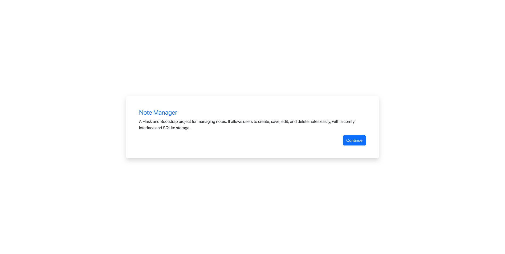
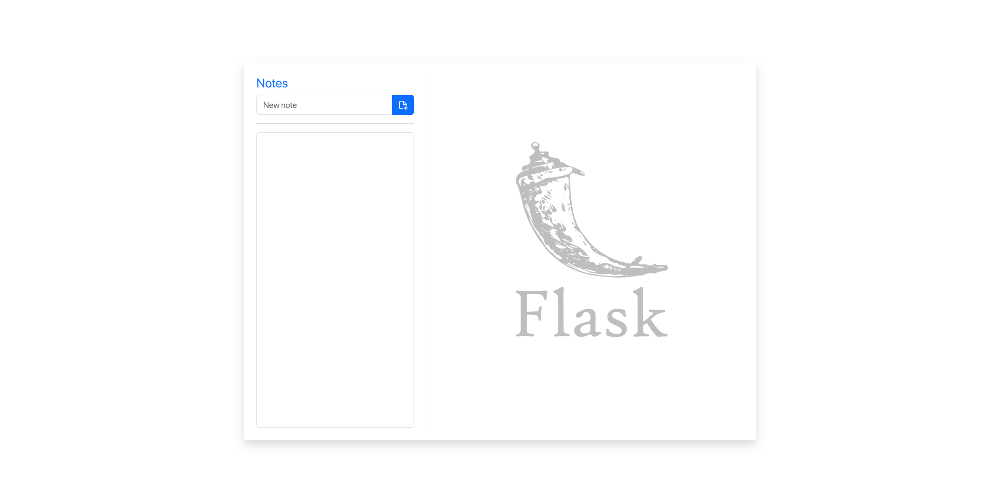
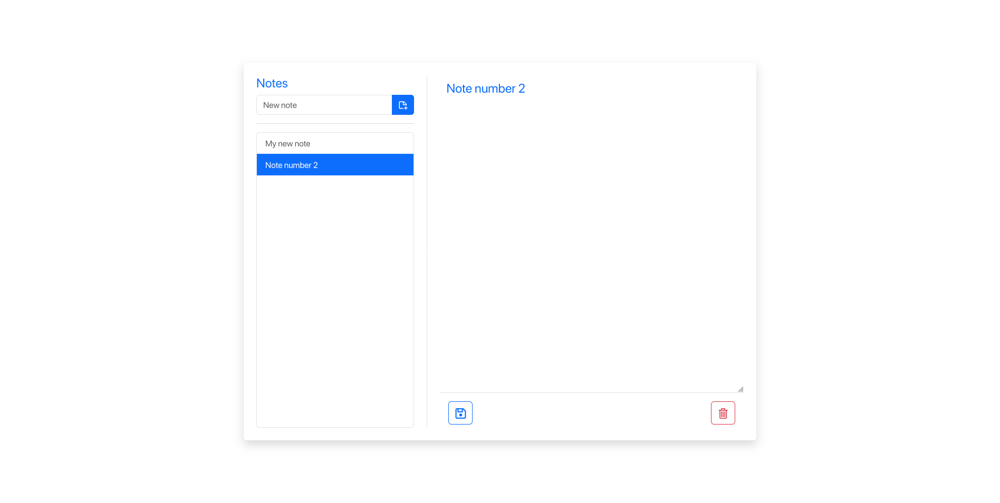
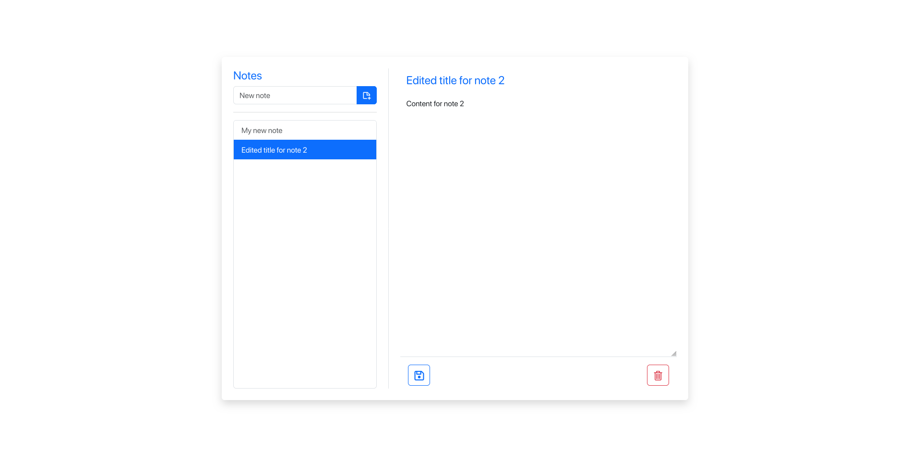
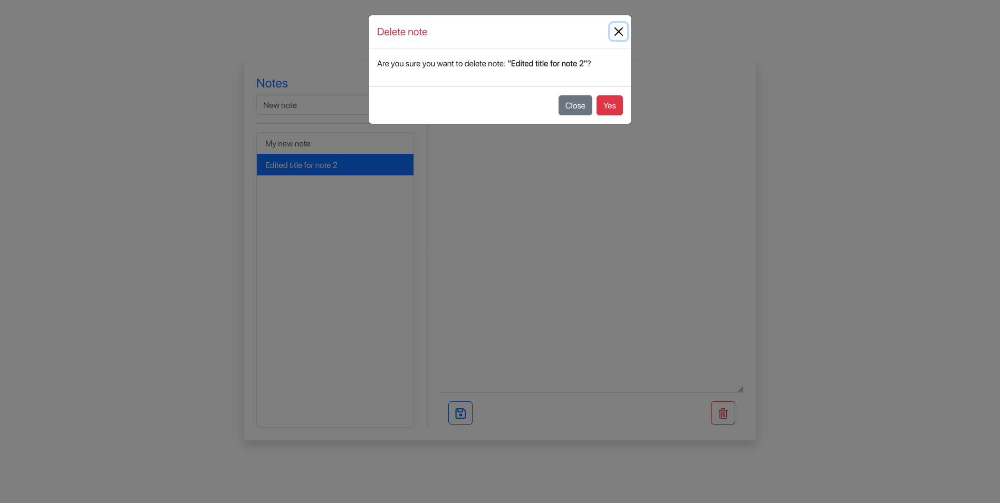

# Basic Notes Web Application
A Flask and Bootstrap project for managing notes. It allows users to create, save, edit, and delete notes easily, with a comfy interface and SQLite storage.

## Features

1. Creation
* Add new note to database
* Display it in a note list
* Automatically displays the new note
* Put the focus on the textarea to be able to edit it.
* Display an alert when note is saved

2. Edit
* Can edit title.
* Save the content into the textarea.
* Display an alert when note is edited.

3. Delete
* Displays a confirmation modal before deleting the note
* Display an alert when note is deleted.

## Screenshots
* Welcome

* Empty

* Notes

* Edited

* Deleted

